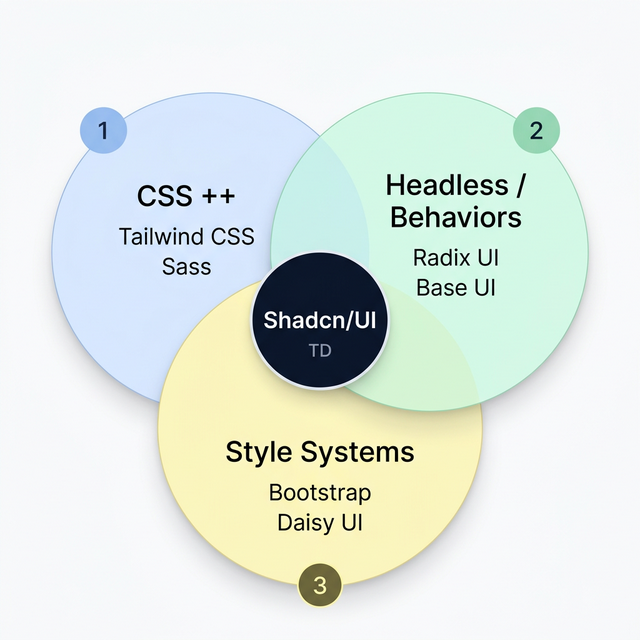

# R4.DWeb-DI.06_26 - L'Écosystème des Librairies UI

Pour bien comprendre le paysage actuel du développement frontend, il est essentiel de cartographier les différentes approches existantes en matière de création d'interfaces utilisateur.

Le paysage moderne peut se diviser en **3 grands domaines** d'outils qui, se croisent et se complètent. À leur intersection exacte émerge une approche hybride qui redéfinit les standards.



---

## 1. Les Extensions de CSS ++ (Le Style Pur)

Ce premier cercle regroupe les outils qui enrichissent ou révolutionnent la façon d'écrire des styles, sans pour autant imposer de composants visuels pré-construits. Ils offrent une abstraction puissante sur le CSS classique.

- **Tailwind CSS :** Le framework utilitaire par excellence. Il fournit des classes de très bas niveau permettant de construire des designs sur mesure directement au sein du HTML ou des composants.
- **Sass / SCSS :** L'extension historique du CSS qui y ajoute des super-pouvoirs de programmation (variables, mixins, imbrication, fonctions).

**💡 Exemple — Un bouton avec Tailwind CSS :**

```html
<button
  class="bg-blue-600 hover:bg-blue-700 text-white font-semibold
               py-2 px-4 rounded-lg shadow-md transition-colors"
>
  Valider
</button>
```

> Beaucoup de contrôle sur le résultat, mais le code HTML devient très verbeux.

| ✅ Avantages                                                     | ❌ Inconvénients                                                              |
| :--------------------------------------------------------------- | :---------------------------------------------------------------------------- |
| **Liberté totale** de design (pixel-perfect)                     | **Aucun comportement natif** (accessibilité et interactions à coder soi-même) |
| Excellente maîtrise du style, courbe d'apprentissage progressive | Les fichiers HTML/JSX peuvent devenir surchargés de classes utilitaires       |
| Fichiers finaux très optimisés en production (tree-shaking)      | Pas de composants "prêts à l'emploi", tout est à construire de zéro           |

**🎯 Cas d'usage idéal :** Landing pages très customisées, projets avec un branding fort nécessitant un design sur-mesure de A à Z.

---

## 2. Les Librairies de Comportement (Headless UI)

Ici, l'objectif n'est pas le style visuel, mais **l'accessibilité**, **l'interactivité** et le **comportement**. Ces bibliothèques fournissent toute la logique complexe des composants avancés (gestion du focus, navigation au clavier, attributs ARIA) de façon invisible — sans appliquer le moindre design.

- **Radix UI :** Une suite de primitives React, ultra-accessibles, robustes et 100% "unstyled".
- **Base UI (par MUI) :** L'approche "headless" des créateurs de Material UI, fournissant l'ingénierie des composants indépendamment de leur apparence.

**💡 Exemple — Un modal avec Radix UI :**

```jsx
<Dialog.Root>
  <Dialog.Trigger>Ouvrir</Dialog.Trigger>
  <Dialog.Portal>
    <Dialog.Overlay />
    <Dialog.Content>
      {/* Focus, fermeture Escape, attributs ARIA… tout est géré. */}
      {/* Mais visuellement, c'est du texte brut sans aucun style. */}
      <Dialog.Title>Titre du modal</Dialog.Title>
    </Dialog.Content>
  </Dialog.Portal>
</Dialog.Root>
```

| ✅ Avantages                                                        | ❌ Inconvénients                                                          |
| :------------------------------------------------------------------ | :------------------------------------------------------------------------ |
| **Accessibilité native (WAI-ARIA)** et navigation clavier gérées    | **Aucun style par défaut**, le rendu initial est brut                     |
| Gain de temps sur la logique complexe (Dropdowns, Modals, Tooltips) | Nécessite obligatoirement une couche de style par-dessus (CSS, Tailwind…) |
| Réduit la dette technique liée aux comportements interactifs        | Courbe d'apprentissage pour comprendre la structure des "primitives"      |

**🎯 Cas d'usage idéal :** Construire son propre Design System "from scratch" en entreprise, pour des équipes qui disposent de leurs propres designers UI.

---

## 3. Les Systèmes de Style Clé en Main (UI Kits)

Le troisième cercle correspond aux bibliothèques qui fournissent une expérience "prête à l'emploi" : des composants déjà développés, stylisés, avec un comportement par défaut. L'intégration est rapide, mais la personnalisation fine est souvent limitée.

- **Bootstrap :** Le framework iconique et pionnier de cette approche, avec sa grille responsive et ses composants pré-désignés.
- **Daisy UI :** Un système construit par-dessus Tailwind CSS, offrant des composants finis via des classes sémantiques (`btn`, `card`, `alert`).

**💡 Exemple — Un bouton avec Daisy UI :**

```html
<button class="btn btn-primary">Valider</button>
```

> Code très propre et immédiat, mais le design est celui imposé par le framework.

| ✅ Avantages                                             | ❌ Inconvénients                                                                 |
| :------------------------------------------------------- | :------------------------------------------------------------------------------- |
| **Vitesse de développement fulgurante** au démarrage     | Le syndrome du "ça ressemble à Bootstrap" : un **design générique**              |
| Tout est inclus : structure, style, interactions de base | **Peu flexible** : sortir du design prévu revient à "lutter contre le framework" |
| Parfait pour des prototypes rapides et back-offices      | Bundle souvent plus lourd si non optimisé                                        |

**🎯 Cas d'usage idéal :** Hackathons, MVP (Minimum Viable Products) développés dans l'urgence, back-offices internes où le design n'est pas prioritaire.

---

## Au Centre : L'approche Shadcn/UI

À l'intersection des trois cercles se trouve un nouveau paradigme de développement, illustré par **Shadcn/UI**.

Il combine concrètement les forces des 3 cercles :

1. **Le Style (Cercle 1) :** Il utilise **Tailwind CSS** pour l'intégralité de sa stylisation.
2. **Le Headless (Cercle 2) :** Il s'appuie sur **Radix UI** pour garantir une accessibilité de niveau professionnel.
3. **Le Clé en Main (Cercle 3) :** Il offre l'apparence et l'usage immédiat d'un Système de Style complet, tout en laissant le code ouvert à 100%.

**💡 Exemple — Un bouton avec Shadcn/UI :**

```jsx
<Button variant="outline" size="lg">
  Valider
</Button>
```

> La simplicité d'un UI Kit, l'accessibilité d'une librairie Headless, la flexibilité de Tailwind.

> [!IMPORTANT]
>
> ### Le Changement de Paradigme : NPM vs Propriété du code
>
> **L'ancienne méthode (Cercle 3) :**
>
> ```bash
> npm install daisyui
> ```
>
> La bibliothèque vit dans `node_modules/`. Si le mainteneur modifie l'apparence d'un composant lors d'une mise à jour, votre site est directement impacté. Vous êtes **dépendant**.
>
> **L'approche Shadcn :**
>
> ```bash
> npx shadcn@latest add button
> ```
>
> Le composant est **généré localement** dans votre dossier `src/components/ui/button.tsx`. Vous devenez le **propriétaire total du code** et l'adaptez selon vos besoins.

| ✅ Le meilleur des 3 cercles                                                     | ❌ Inconvénients                                                                       |
| :------------------------------------------------------------------------------- | :------------------------------------------------------------------------------------- |
| **Propriété du code :** Les composants vivent chez vous, pas dans `node_modules` | Le code généré par composant peut intimider les débutants (il expose Radix + Tailwind) |
| Accessibilité complète gérée par les experts de Radix UI                         | Les mises à jour des composants sont plus manuelles (pas de `npm update`)              |
| Flexibilité visuelle totale, le rendu est 100% modifiable                        | Orienté vers des frameworks modernes (React, Vue, Svelte)                              |
| **Zéro gonflement :** Vous ne générez que les composants que vous utilisez       |                                                                                        |

**🎯 Cas d'usage idéal :** Web Apps modernes (SaaS, dashboards), pérennes et évolutives, où l'on recherche un niveau professionnel sur l'accessibilité tout en gardant une liberté de design totale.

---

## Tableau comparatif de synthèse

| Critère                       |   CSS ++   |  Headless  |  Style Systems  |  Shadcn/UI  |
| :---------------------------- | :--------: | :--------: | :-------------: | :---------: |
| **Flexibilité visuelle**      |   ⭐⭐⭐   |   ⭐⭐⭐   |       ⭐        |   ⭐⭐⭐    |
| **Accessibilité native**      |     ❌     |   ⭐⭐⭐   |      ⭐⭐       |   ⭐⭐⭐    |
| **Vitesse de démarrage**      |    ⭐⭐    |     ⭐     |     ⭐⭐⭐      |   ⭐⭐⭐    |
| **Poids du bundle**           |   ⭐⭐⭐   |   ⭐⭐⭐   |       ⭐        |   ⭐⭐⭐    |
| **Propriété du code**         | ✅ (natif) | ✅ (natif) | ❌ (dépendance) | ✅ (généré) |
| **Personnalisation profonde** |   ⭐⭐⭐   |    ⭐⭐    |       ⭐        |   ⭐⭐⭐    |

---
